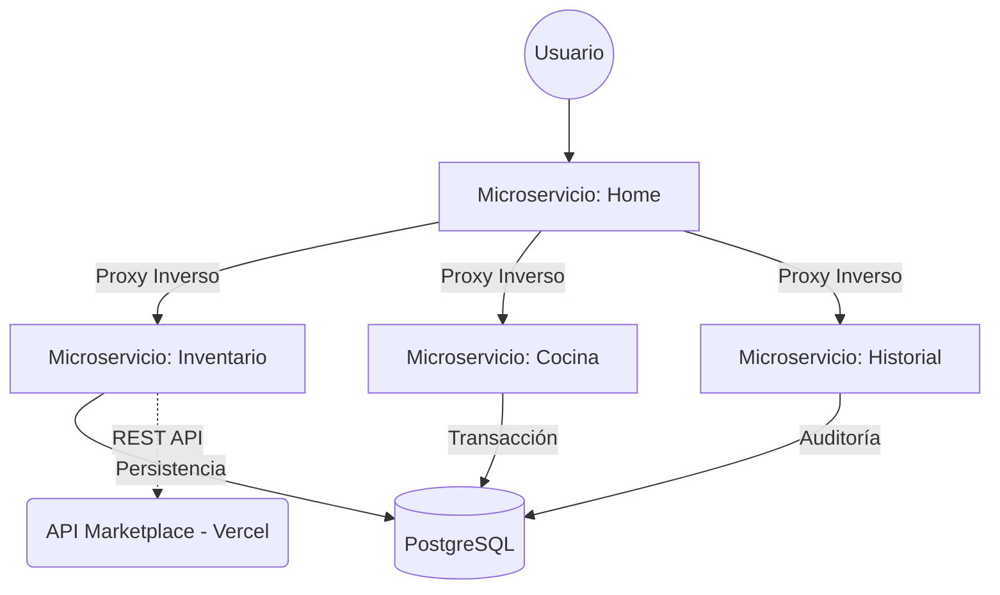

# [Comia's](https://comias-home.onrender.com/) - Arquitectura de Software 2024

 

## Contexto y Evolución del Proyecto

Este proyecto es una implementación avanzada de una arquitectura de microservicios diseñada para la gestión integral de un restaurante. Desarrollado en el marco de la asignatura **Arquitectura de Software (2024)** de la **Universidad de Bogotá Jorge Tadeo Lozano**, el sistema integra patrones modernos de desarrollo, principios de DevOps y una infraestructura resiliente basada en la contenerización. se realizó una intervención técnica para migrar la lógica de consumo hacia una infraestructura en **Vercel** y el despliegue de microservicios en **Render**. Esta transición no solo mantuvo la operatividad, sino que permitió optimizar los tiempos de respuesta y la disponibilidad del servicio.

El enfoque central es demostrar el **desacoplamiento total de responsabilidades** mediante el uso de microservicios independientes, garantizando que fallos en un componente no comprometan la totalidad del sistema.

<!-- PONER AQUÍ UNA IMAGEN O CAPTURA DE LA LANDING PAGE DESPLEGADA EN RENDER -->

---

## Arquitectura y Patrones de Diseño

La solución se fundamenta en un ecosistema de cuatro microservicios que operan en una red virtualizada aislada (`restaurant-network`):

1.  **Home (Gateway & Proxy):** Implementa el patrón **Reverse Proxy**. Centraliza el tráfico y redirige peticiones de forma dinámica a los servicios internos, abstrayendo la complejidad de la infraestructura al cliente final.

2.  **Inventario:** Servicio especializado en la gestión de stock. Implementa lógica de reabastecimiento automático mediante integraciones externas con la API Marketplace.

3.  **Cocina:** Orquestador de pedidos que interactúa en tiempo real con el inventario para validar la viabilidad de las recetas.

4.  **Historial:** Componente de auditoría y persistencia de eventos para el seguimiento de transacciones.

### Diagrama de Comunicación e Infraestructura

<!-- PONER AQUÍ UN DIAGRAMA MÁS DETALLADO DE LA BASE DE DATOS O RELACIONES DE SERVICIOS -->

---

## DevOps e Integración Continua (CI)

El proyecto adopta una mentalidad de **DevOps** para asegurar que cada cambio en el código sea estable y escalable:

*   **GitHub Actions (CI Workflow):** Ubicado en `.github/workflows/ci.yml`, el pipeline automatizado ejecuta:
    *   **Linting:** Validación estricta de código Python utilizando `flake8` para mantener estándares de calidad y legibilidad.
    *   **Automated Builds:** Verificación de la integridad de las imágenes de Docker para cada microservicio en cada `push` a la rama principal.
*   **Gestión de Infraestructura:** Uso de **Docker Compose** para definir y correr aplicaciones multi-contenedor, incluyendo:
    *   **Aislamiento de Red:** Los servicios se comunican internamente sin exponer puertos innecesarios, mejorando la seguridad.
    *   **Healthchecks:** Monitoreo activo de la salud de cada servicio para asegurar que el tráfico solo se dirija a instancias operativas.
    *   **Límites de Recursos:** Configuración de cuotas de CPU y Memoria (256MB/0.50 CPU) para simular un entorno de producción optimizado.

---

## Tecnologías y Herramientas

*   **Frontend:** HTML5, CSS3, JavaScript (JQuery), Bootstrap.
*   **Backend:** Python 3.x con el framework Flask.
*   **Persistencia:** PostgreSQL como motor de base de datos relacional.
*   **Contenerización:** Docker para el empaquetado y aislamiento de dependencias.
*   **Cloud & Networking:** Integraciones con Vercel API y despliegue distribuido.

<!-- PONER AQUÍ UNA CAPTURA DE PANTALLA DE LA TERMINAL CORRIENDO LOS CONTENEDORES CON 'docker compose ps' -->

---

